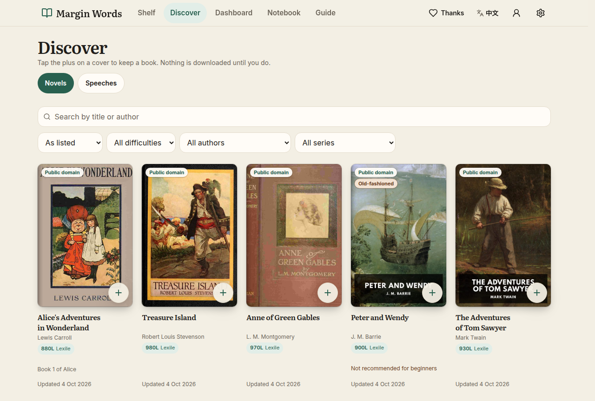

# Margin Words

[](https://inputread.site)
[](LICENSE)

> **Public repository.** Development, pushes, and pull requests happen here. The owner archived the private archive [duwqijlk/margin-words-archive](https://github.com/duwqijlk/margin-words-archive) on 2026-10-04. It is read-only and stays private. Record: [docs/ARCHIVE.md](docs/ARCHIVE.md).

A reader for English novels, made for Chinese junior-high learners. Tap a word and see a short English meaning written for that book. The buttons and menus are in **Simplified Chinese or English**. The books stay in English. There is no AI.

**[Open the reader](https://inputread.site)** · [In Chinese](README.zh-CN.md)



## About this project

Margin Words is a reader for English novels. It is made for Chinese junior-high students who are starting to read real books in English.

Tap a word in the story. A card shows a short meaning in simple English, written for that book. Notes for a paragraph, a sentence, or a phrase stay beside the text, and the page does not jump when a card opens. The buttons and menus are in Simplified Chinese or English. The novels stay in English. The reader has no AI.

A book already on the device can be read with no account and, after the first download, with no network. New books are added only from Discover, and that step needs a sign-in. Public-domain classics download from the books host. A novel that is still under copyright is not hosted here: Discover gives a word list and an ISBN, and the reader adds their own legal EPUB.

The live reader is [inputread.site](https://inputread.site). This repository is the source, under the [MIT license](LICENSE).

## What you can do

- **Read with a meaning on the word.** Tap a word. A card shows a simple English meaning from that book's word list. A word that is not in the list says so. The card floats over the page, and the text does not move.
- **Notes beside the paragraph.** A paragraph with a note keeps a small light beside it. Sentence notes and phrases open from the text in the same way.
- **A shelf, then Discover.** A new shelf is empty and points to Discover. Discover is the only place to add a book, and adding needs a signed-in account. A signed-out visitor can still browse every title. Books already stored on the device stay readable.
- **Public-domain classics.** Alice, Treasure Island, and the other free books download when you add them. Speeches sit on their own tab.
- **Copyrighted books stay with the reader.** For those titles, Discover offers a word list and an ISBN, not the novel. You add your own EPUB of that book. The app shows how well the file matches, and it warns you when the match is under 80%.
- **A notebook.** Save a word and review it later. Each word is one card, with the sentence it came from.
- **A library dashboard.** One page counts the whole Discover library: books, marked words, paragraph notes, sentence notes, phrases, and series.
- **Saved on this device.** The book and its word list stay in the browser. Opening the site needs the internet.
- **An optional account.** Sign in to add books. The same account can sync the shelf, the reading place, saved words, and settings. Reading itself does not need an account.

Built with Vite, React, and Tailwind. Accounts, when they are turned on, use Cloudflare Pages Functions and D1. See [docs/ACCOUNTS.md](docs/ACCOUNTS.md).

## Run it on your computer

```bash
npm install
npm run dev
```

Open <http://localhost:8080>.

`npx vite build` writes the static site to `dist/` (HTML, JS, CSS, and fonts). Book files are not in that folder. A production build loads books from `https://books.inputread.site`. `npm run build:local` leaves book URLs on the same origin, which the tests use.

Any static host can serve `dist/`. The optional account API is a Pages Function next to those files. Without the functions, the reader is unchanged.

## Make a book pack

The app does not import a loose EPUB, and it does not import a zip. Readers add books from Discover.

A **book pack** is how a book is prepared for that catalog: one `.zip` with exactly `book.epub` and `glossary.json`. The rules are in [docs/book-pack-spec.md](docs/book-pack-spec.md), section 3.

`book-pack-kit.zip` is for a person, or an AI agent, who is making a pack. It holds the spec, the sample story *The Lantern Seller*, its word list, and a finished sample pack. In the app, Guide and Settings link to “How to make a book pack” (`/kit/`).

```bash
node scripts/make-pack.mjs book.epub glossary.json my-book.pack.zip
npm run build:kit
npm run check:example
```

## License

The application source is released under the [MIT License](LICENSE).

Copyright (c) 2026 XCRUN.

You may use, copy, and change the reader, the account functions, and the tools in this repository. Keep the copyright notice and this permission notice with the code.

The novels are a separate matter:

| Material | Terms |
| --- | --- |
| Reader, Pages Functions, and tools | [MIT License](LICENSE) |
| *The Lantern Seller*, the sample story | Original text, [CC0](https://creativecommons.org/publicdomain/zero/1.0/). See [docs/book-pack-spec.md](docs/book-pack-spec.md). |
| Public-domain books | Public domain. Their files are not in git. The books host serves them. |
| Books still under copyright | Not in this repository. This project does not host, sell, or share them. Discover lists a word list and an ISBN. The reader brings their own legal EPUB. |
| Word lists (`glossary.json`) | Study notes for this app. A short quotation in a note stays with its author and publisher. |
| [English Read](https://github.com/bitbw/english-read) | A separate project, Copyright (c) 2026 English Read contributors, [MIT](https://github.com/bitbw/english-read/blob/main/LICENSE). Margin Words was inspired by it and is its own app. |

Questions about a copyrighted excerpt: open an issue at <https://github.com/duwqijlk/margin-words/issues>.

## Develop and host

### Where the book files live

A clone of this repository has the word lists and the sample story. It does not have the novels. Copyrighted EPUBs belong in the private bucket `margin-words-private`. Public-domain EPUBs belong on `https://books.inputread.site`. The only EPUB in git is `examples/sample-book/the-lantern-seller.epub`.

On a machine that also has the book files, the folders look like this:

```
packs/catalog.json         list of the copyrighted titles
packs/<id>/glossary.json   that title's word list
packs/<id>/book.epub       local only; git ignores it
public-books/              the free classics, same idea
```

`npm run build:books` writes `dist-books/`: loose classic files, loose word lists, a card-sized cover when `packs/<id>/cover.jpg` exists, and the catalogs. No zip, and no copyrighted EPUB. A word-list book with no cover keeps the generated title-and-author cover in the app.

`npm run build:private` writes `dist-private/` from a local `packs/<id>/book.epub` (the EPUB, its glossary, and its cover). Upload that folder only to `margin-words-private`. The app never fetches that bucket. Do not put `dist-private/` inside `dist/` or `dist-books/`.

Word-list format: [docs/GLOSSARY_FORMAT.md](docs/GLOSSARY_FORMAT.md). Pack folder: [docs/PACKS_FORMAT.md](docs/PACKS_FORMAT.md). Rebuild the local catalogs with `node scripts/build-packs.mjs`.

### Put the site and the books online

1. Build the front end with `npx vite build`. Deploy `dist/` to Cloudflare Pages. The production build fetches books from `https://books.inputread.site`. Set `VITE_BOOKS_BASE` to use another host.
2. Build the book objects with `npm run build:books`, then upload each file with its path as the object key:

   ```bash
   cd dist-books && find . -type f | sed 's|^\./||' | while read -r key; do
     npx wrangler r2 object put "$BUCKET/$key" --file "$key" --remote
   done
   ```

   The bucket behind `https://books.inputread.site` must allow cross-origin reads from `https://inputread.site`, `https://www.inputread.site`, `https://margin-words.pages.dev`, and localhost. The page reads the book file from that response and stores it in the browser.
3. Leave `packs/`, `site/`, and `dist-private/` off the public host. `node scripts/build-site.mjs` writes `site/` (`dist/` plus `packs/`) for a machine of your own.

A reader can also set another catalog address in Settings. That host must allow cross-site reads. Addresses inside `catalog.json` are relative to the catalog file.

### How a book gets onto a shelf

1. Open the app. A new shelf is empty and suggests *Alice's Adventures in Wonderland*. The suggestion links to Discover.
2. Sign in. On Discover, tap the plus on a cover. The plus becomes a check (“On shelf”). Tap the check and choose “Remove from shelf” to take it off. A book you just added can be undone. A book you have started, or one that has your own EPUB, asks first.
3. A public-domain book downloads when you add it. A word-list book downloads its word list and asks for your EPUB of the ISBN on the card. A match under 80% is shown before it is saved. The book and the word list are stored in the browser (IndexedDB).
4. After that, the book and the word list stay on this device (IndexedDB). Opening the site needs the internet. The service worker does not serve the page.
5. When a word list changes (a new `rev`), the next load fetches the new list in the background. The book file, reading place, saved words, and settings stay. A small notice says how many books were updated. A list the reader added or edited by hand is never replaced. If a new list matches the reader's EPUB under 80%, or an automatic update fails, the old list stays and the Discover card shows a manual **Update** button with the reason.

The shelf menu can still **Add word list** (a `.json` for a book that is already there).

### Checks

```bash
npx tsc --noEmit
npm run check:cjk          # Chinese only in src/lib/i18n-zh.ts, docs/, and README.zh-CN.md
npm run check:example
node scripts/validate-glossary.mjs packs/twits/book.epub packs/twits/glossary.json
node scripts/build-packs.mjs --check
npm test
```

### Languages in the interface

Every visible string lives in two dictionaries with the same keys: `src/lib/i18n-en.ts` and `src/lib/i18n-zh.ts`. A missing key fails `npx tsc --noEmit`. The first visit follows the browser language (Chinese to Chinese, anything else to English), and the choice is saved. Book content (meanings, notes, phrases, titles) is never translated.

### This public repository

Development happens here. Older pull requests stay in the private archive [duwqijlk/margin-words-archive](https://github.com/duwqijlk/margin-words-archive). Record: [docs/ARCHIVE.md](docs/ARCHIVE.md). Moving the project: [MIGRATION.md](MIGRATION.md).

## Credit

The idea for this reader comes from [English Read](https://github.com/bitbw/english-read) (Copyright (c) 2026 English Read contributors, [MIT License](https://github.com/bitbw/english-read/blob/main/LICENSE)). Margin Words is a separate app. The Guide page says the same thing.
